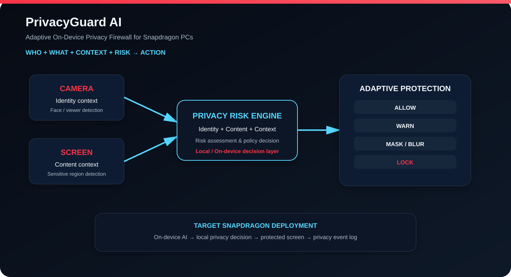

# PrivacyGuard AI

### Adaptive On-Device Privacy Firewall for Snapdragon PCs

> **Know the User. Understand the Data. Protect the Moment.**

PrivacyGuard AI is a privacy-first AI concept for personal computers that makes **context-aware privacy decisions** instead of treating privacy as a simple ON/OFF setting.

It combines four signals:

**WHO is viewing → WHAT is being viewed → WHAT is the context → WHAT level of risk exists**

and maps them to an adaptive response:

**ALLOW → WARN → MASK → BLUR → LOCK**



---

## Why this matters

A laptop may display highly sensitive information such as OTPs, account details, identity documents or confidential files. The correct privacy response can change depending on who is using the device and whether another person is viewing the screen.

PrivacyGuard AI is designed around that missing context layer.

---

## Core Architecture

```text
                         PRIVACYGUARD AI
                               │
                ┌──────────────┴──────────────┐
                │                             │
             CAMERA                        SCREEN
                │                             │
                ▼                             ▼
        Identity Analysis             Content Analysis
                │                             │
                └──────────────┬──────────────┘
                               ▼
                      PRIVACY RISK ENGINE
                               │
                 Identity + Content + Context
                               │
                  ┌────────────┼────────────┐
                  ▼            ▼            ▼
                ALLOW         MASK       LOCK/WARN
```

See [`docs/architecture.md`](docs/architecture.md) for the detailed design.

---

## Current Prototype Scope

The project is being developed around seven demonstrable capabilities:

1. **Authorized-user verification** — camera-based face detection/verification concept.
2. **Sensitive-content detection** — OTPs, IDs, account information and confidential documents.
3. **Adaptive privacy engine** — identity + content + context → protection action.
4. **OTP privacy protection** — controlled demo application with explicit camera permission.
5. **Live privacy shield** — mask or blur sensitive screen regions.
6. **Shoulder-surfing protection** — a second viewer can increase privacy risk.
7. **Privacy event log** — record privacy-relevant detection and protection events.

### Illustrative decision matrix

| User / context | Content | Risk | Example action |
|---|---|---:|---|
| Authorized user | Normal | Low | Allow |
| Authorized user | Sensitive | Medium | Controlled Allow |
| Unknown user | Sensitive | High | Mask |
| Unknown user | Highly sensitive | Critical | Lock |
| Second person | Sensitive | High | Mask |

---

## Snapdragon + On-Device AI

PrivacyGuard AI is designed for **target deployment on Snapdragon-powered PCs**. The architecture emphasizes local processing for privacy-sensitive decisions and reduced dependence on cloud round-trips.

Qualcomm AI Hub-compatible model concepts are considered for face detection, face verification and vision processing.

The repository intentionally avoids unverified accuracy, FPS, latency, benchmark or production-deployment claims.

---

## Product Flow

```text
OBSERVE
  ↓
Understand the user and screen context
  ↓
ASSESS
  ↓
Estimate privacy risk
  ↓
PROTECT
  ↓
Allow / Warn / Mask / Blur / Lock
  ↓
LOG
  ↓
Create an auditable privacy event
```

---

## Future Vision

PrivacyGuard AI can evolve from a reactive privacy shield into an intelligent privacy agent:

- Predictive privacy
- Cross-device privacy
- Enterprise privacy policies
- Application-aware privacy
- Privacy-preserving AI
- Autonomous privacy agent

Future loop:

**Predict → Understand Context → Anticipate Risk → Protect Automatically**

---

## Technical Status

**Prototype under development.**

The architecture and Snapdragon integration described here represent the proposed target deployment. The repository separates current prototype scope from future vision so that implementation status remains transparent.

The OTP workflow is intended for a controlled demonstration application that explicitly requests camera permission; it does **not** imply silently activating another application's camera.

---

## Repository Structure

```text
PrivacyGuard-AI/
├── README.md
├── LICENSE
├── .gitignore
├── assets/
│   └── architecture.svg
├── docs/
│   ├── architecture.md
│   └── project-brief.md
├── prototype/
│   └── README.md
├── src/
│   └── README.md
├── submission/
│   └── README.md
└── PROJECT_STATUS.md
```

---

## Challenge Positioning

This project is intended as a **Snapdragon + on-device AI privacy use case**. The central design goal is to make privacy adaptive to the viewing context while keeping sensitive decision-making close to the device.

**Your Data. Your Device. Your Privacy.**
